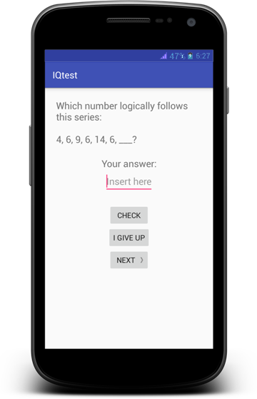
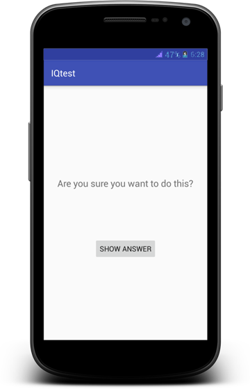

IQtest App
===================================

This application is for those who would like to know their IQ.

Pre-requisites
--------------

	* Android SDK v26
    * Android Build Tools v27.0.1
    * Android Support Repository v47.0.0
    * Google Repository v58

Getting Started
---------------

This sample uses the Gradle build system. To build this project, use the
"gradlew build" command or use "Import Project" in Android Studio.

	